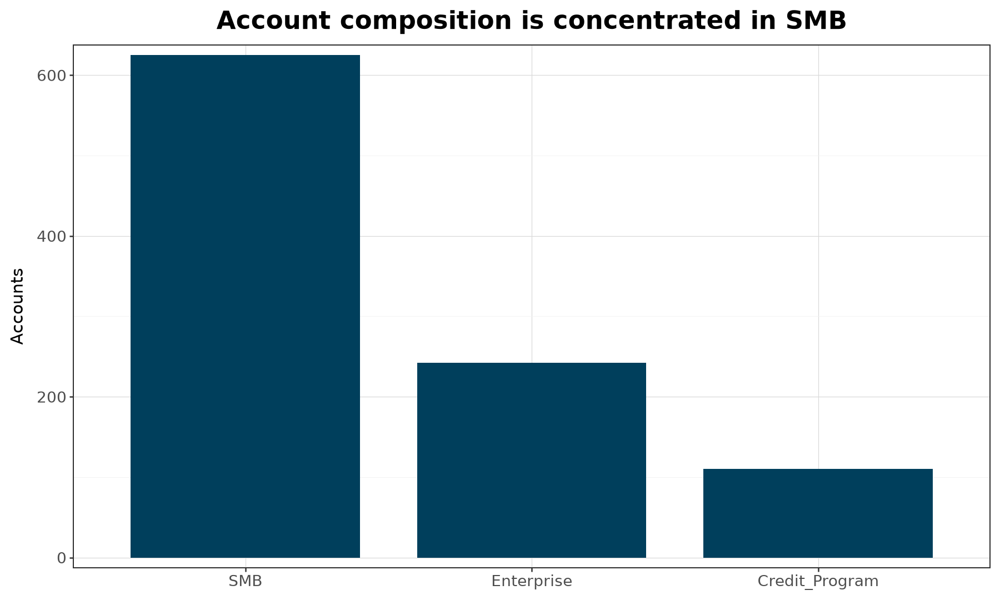
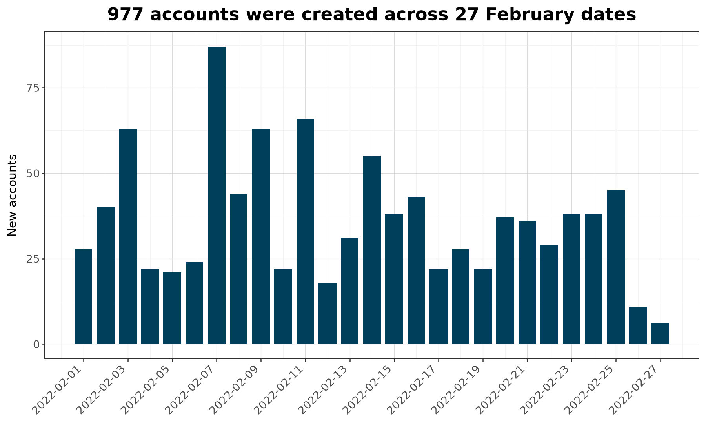
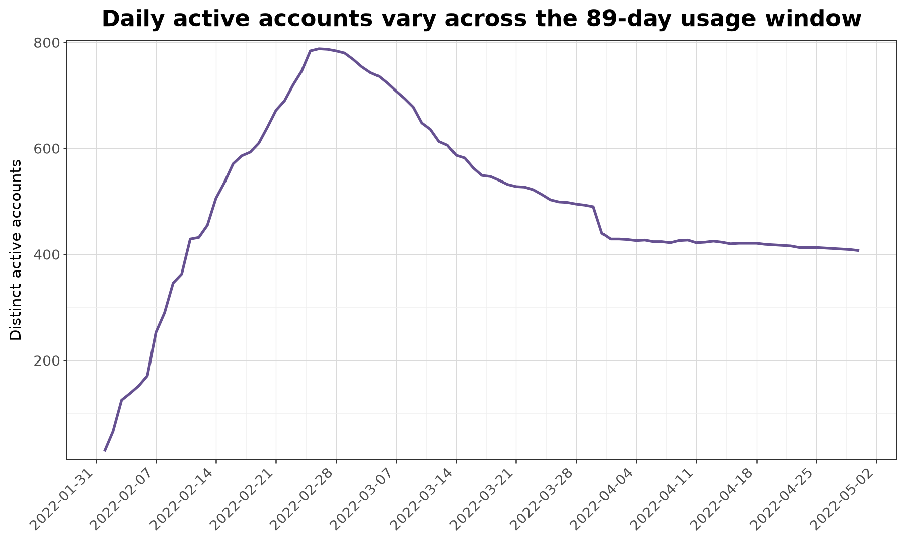

# Dataset summary

Generated by `profile_and_visualize.py` from the three repository CSV files.

## Descriptive snapshot

| Dataset | Grain | Rows | Distinct accounts | Time coverage |
|---|---|---:|---:|---|
| `Case_AccountData.csv` | one row per account | 977 | 977 | not applicable |
| `Case_AccountCreation.csv` | one row per account creation record | 977 | 977 | 2022-02-01 to 2022-02-27 |
| `Case_UsageData.csv` | one row per account-day with observed usage | 44,352 | 977 | 2022-02-01 to 2022-04-30 |

Every source column is non-null in the supplied files. The usage table covers
all 977 accounts in the creation table (100% account coverage), with
44,352 account-day rows and 45.4 observed usage days per account on average.

## Key distributions

- Customer type: SMB (625), Enterprise (242), Credit_Program (110).
- Development language: unknown (362), dotnet (266), node (119), python (105), php (84), java (41).
- Account creation is represented at daily and week-start keys; the week keys span five Sunday-start buckets.
- Usage has one date key per observed account-day. A missing account-day means no observed usage in this extract; it is not proof of non-use.

## Figures

## Caveats and join guidance

1. Join the three datasets on `AccountID`; it is unique in the account and
   creation tables and repeats in usage at the account-day grain.
2. `AccountCreatedDay` and `UsageDate` are ISO timestamps serialized as text,
   while the `_Key` columns are `YYYYMMDD` text keys. Parse them as dates
   before sorting or calculating intervals.
3. `DevLanguage = unknown` is an explicit category, not a null. Preserve it
   as a reported value unless a business rule says otherwise.
4. The extract is right-censored at 2022-04-30 for usage and includes only
   February 2022 acquisition. Longer-term retention cannot be inferred for
   later cohorts without a comparable observation window.
5. These are descriptive coverage summaries. They do not support causal
   claims, retention definitions, or comparisons without specifying cohort,
   denominator, observation window, and treatment of unobserved days.
