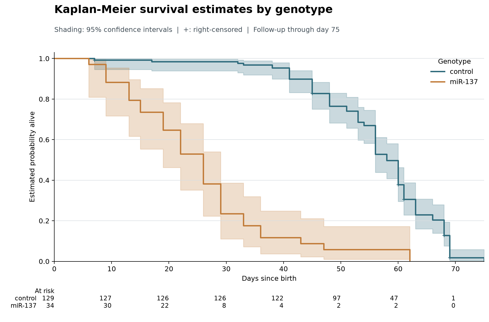

# Kaplan–Meier

## Learning goals

- Explain what a Kaplan–Meier curve estimates.
- Identify an event, time origin, duration, groups, and right-censoring.
- Read confidence intervals and numbers at risk without overclaiming.

## When time-to-event analysis fits

Use time-to-event methods when both **whether** an event occurs and **when** it occurs matter.

- Examples: time to churn, failure, relapse, or adoption.
- Include units with incomplete follow-up when the event has not yet been observed.
- Define the event, time origin, follow-up duration, and censoring rule first.

KM alone does not adjust for other characteristics, establish causation, test a group difference, or handle competing events.

## What the curve estimates

The survival function, \(S(t)\), estimates the probability of remaining event-free beyond time \(t\).

- At an observed event time, the estimate steps down based on events among units still at risk.
- A right-censored unit contributes follow-up up to its last observed time, but is not counted as an event.
- Shaded confidence intervals show uncertainty; censor marks show censored times.
- The at-risk row shows how many observations support each part of the curve.

## The worked example

The existing notebook uses the 163-observation Waltons dataset from `lifelines.datasets`.

| Element | Definition |
|---|---|
| Event | Death |
| Time origin | Birth |
| Time unit | Days (`T`) |
| Event indicator | `E=1`: death observed; `E=0`: right-censored |
| Groups | `control` and `miR-137` genotype |

The dataset documentation describes censoring when natural death is not observed, including accidental killing or escape before natural death.

## Saved group summaries

| Group | n | Deaths observed | Censored | Median | Follow-up through |
|---|---:|---:|---:|---:|---:|
| control | 129 | 122 | 7 | 58 days | 75 days |
| miR-137 | 34 | 34 | 0 | 26 days | 62 days |

Overall median in the saved notebook: **56 days**. The median is when estimated event-free probability reaches 0.5.

## Read the saved curve

{width=9.1in}

## Check the number at risk

Counts transcribed from the saved figure:

| Day | control | miR-137 |
|---:|---:|---:|
| 0 | 129 | 34 |
| 30 | 126 | 8 |
| 50 | 97 | 2 |
| 60 | 47 | 2 |
| 70 | 1 | 0 |

Only two miR-137 flies remain at risk at day 60. Late estimates are therefore uncertain and should not be read as stable evidence.

## Assumptions and limitations

- Censoring should be sufficiently non-informative: it should not conceal systematically different event risk.
- Event, time origin, and units must be consistent across groups.
- Follow-up support differs here: control is observed through day 75, miR-137 through day 62; group sizes and censoring also differ.
- KM is unadjusted. A curve or median difference alone is neither a causal conclusion nor a significance test.
- These results apply only to the Waltons teaching example—not customer retention.

## Takeaway

KM uses censored follow-up to estimate event-free probability over time. Read the curve together with its confidence bands, censor marks, and number at risk—and keep conclusions descriptive unless a suitable design and additional analysis support more.

## References

- [`KaplanMeierFitter` API](https://lifelines.readthedocs.io/en/latest/fitters/univariate/KaplanMeierFitter.html)
- [`lifelines` datasets and Waltons data](https://lifelines.readthedocs.io/en/latest/lifelines.datasets.html)
- Saved analysis and figure: `kaplan_meier_waltons.ipynb` and `outputs/figures/waltons_kaplan_meier.png`

Rendering these slides does not execute the notebook, run Python analysis, or regenerate the figure. Use the report-only commands in the project README.
